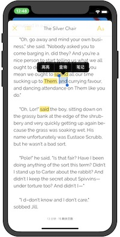

# epub_reader

epub_reader是款epub电子书阅读器，是对[folioreader](https://folioreader.github.io/FolioReaderKit/)这个框架的封装。

## 一行代码即可
   
	   /**
	   * @title 电子书标题
	   * @bookPath 电子书文档路径
	   * @limitPages 限制阅读页数，为0表示不限制页数
	   */
	EpubReader.open('title','bookPath', limitPages);
	
